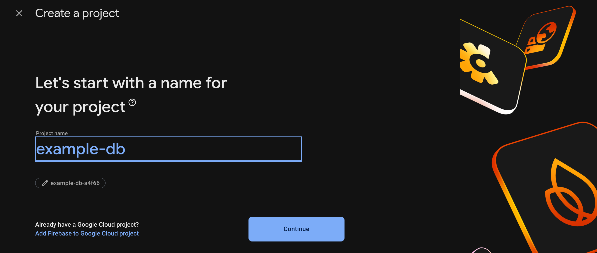
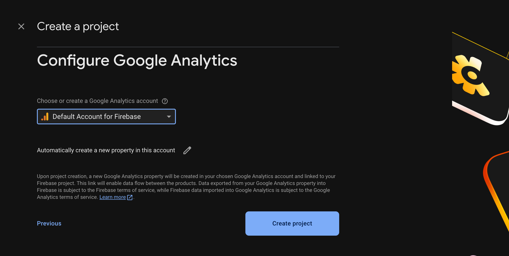
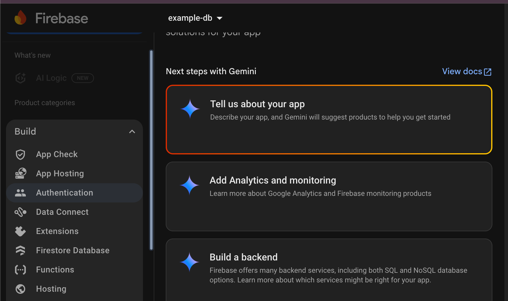
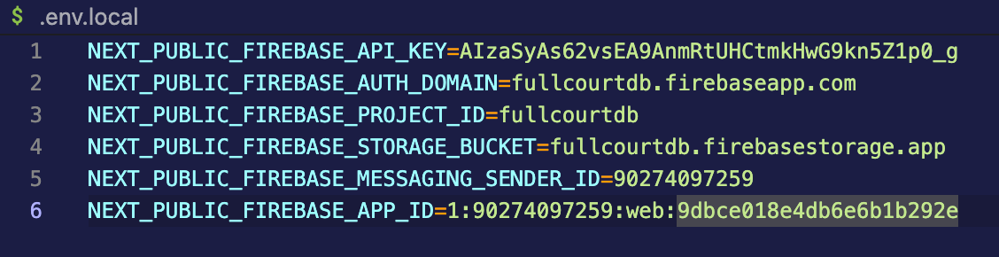

# Replicate the Development Environment:
## Replicating via Docker ->
### Install Prerequisites
- Make sure Docker is installed on your machine
    - https://www.docker.com/products/docker-desktop
- Create an account and set up the desktop application
### Clone Repos
- Make a clone of our repository:
    - https://github.com/eewmercer/full-court-analytics-code
### Get Env Variables
- If granted permission, you will be given a secret file called .env.local by a member of this project, which is crucial to run our project
- Put the envfile in the root of the project.
### Run 
- Open the project in your favorite IDE: https://code.visualstudio.com/download
- Run the following file while in the root folder of the project :
    - `docker compose up`
    - If Docker proposes to share folder(s), allow

## Background ->
1.  Tech used ->
    - NextJS React
    - TypeScript
    - Tailwind CSS
    - Firebase database

## Backend Steps ->
1. Clone repository from GitHub ->
    - copy HTTPS url
    - choose the desired location and then `git clone (url)` in the terminal
2. Install dependencies ->
    - `npm install` in terminal
3. Create Firesbase Database ->
    - name your database
        - 
    - click continue until you reach the account section; use the default account
        - 
    - click on build and then Firestore
        - 
    - use the standard edition
    - set location to `nam5 (United States)`
    - start in production mode
    - add dummy data in this same format:
        - coach (collection):
            - 
        - school (collection):
            - 
        - users (collection):
            - 
    - create a `.env.local` file in your local repository with the following variables:
        - 

## Frontend Steps:
1. Run project ->
    - `npm run dev` in terminal
    - click the localhost link and it will route you to the webpage in your browser

## Testing:
### To run acceptance test, specifically e2e email tests:
Run these commands each in separate terminals:
- docker run -d --name mailhog -p 1025:1025 -p 8025:8025 mailhog/mailhog
- >> $env:MAIL_PROVIDER="mailhog" $env:SMTP_HOST="127.0.0.1" $env:SMTP_PORT="1025" $env:MAIL_FROM="e2e@fullcourt.local" npm run dev
- npx cypress run

### To run unit tests on console: run test -- --coverage
1. login with test credentials:
    - email - dev@demo.com
    - password - Password12!
2. If login works, then you are in!

    - 
    - 
    - 
    

