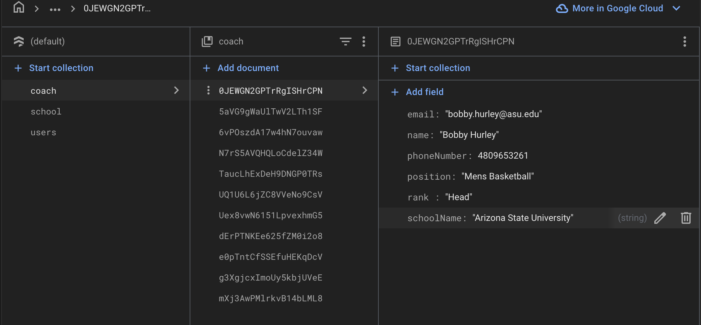
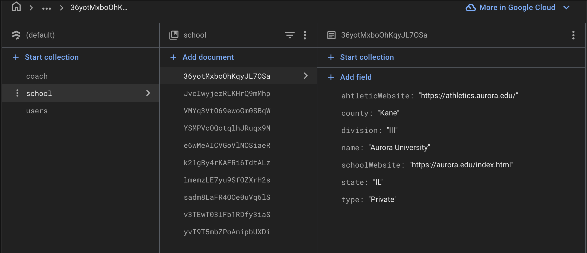
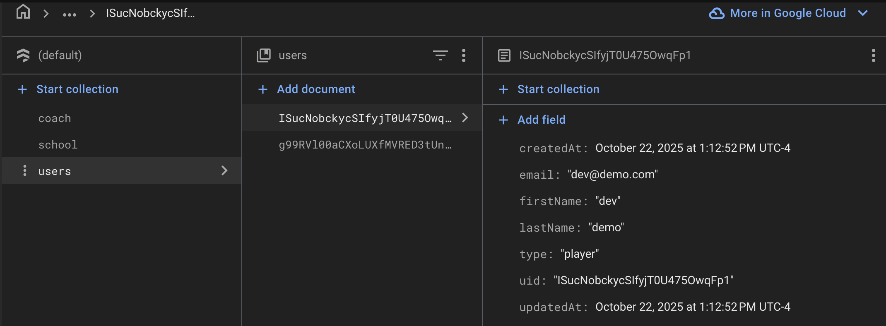
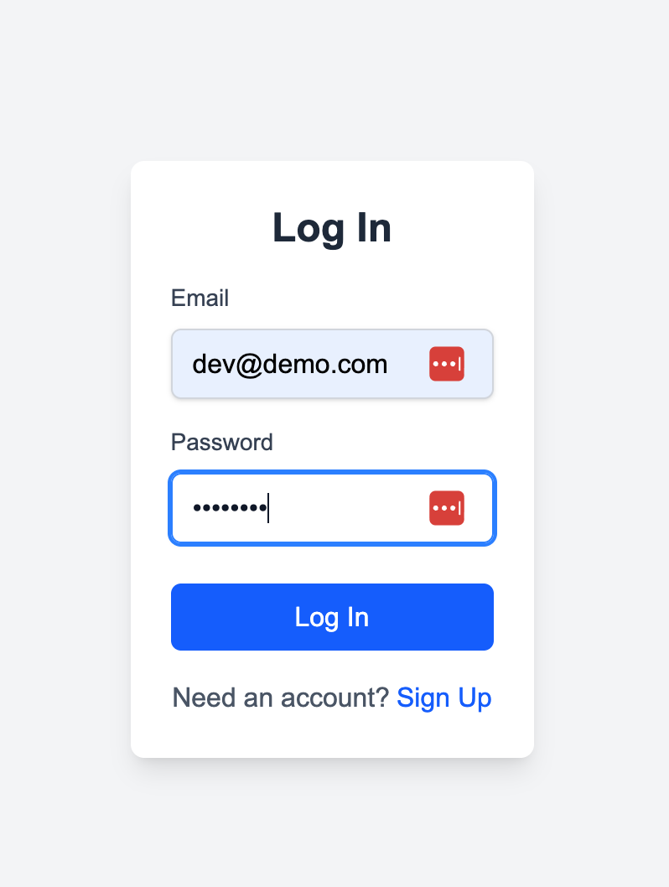
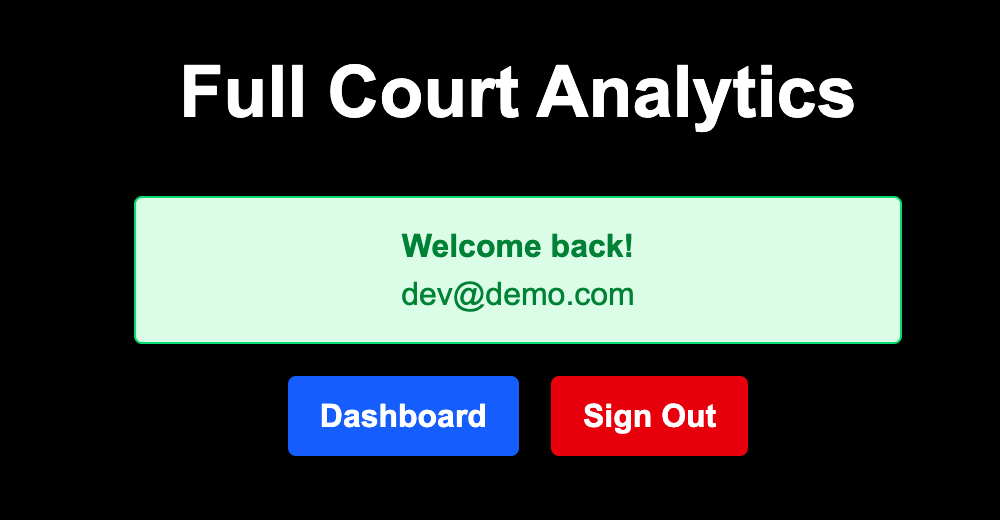

# Replicate the Development Environment:
## Replicating via Docker ->
### Install Prerequisites
- Make sure Docker is installed on your machine
    - https://www.docker.com/products/docker-desktop
- Create an account and set up the desktop application
### Clone Repos
- Make a clone of our repository:
    - https://github.com/eewmercer/full-court-analytics-code
### Get Env Variables
- If granted permission, you will be given a secret file called .env.local, which is crucial to run our project
- Put the envfile in the root of the project.
### Run 
- Run the following file while in the root folder of the project:
    - `docker compose up`
    - If Docker proposes to share folder(s), allow

## Background ->
1.  Tech used ->
    - NextJS React
    - TypeScript
    - Tailwind CSS
    - Firebase database

## Backend Steps ->
1. Clone repository from GitHub ->
    - copy HTTPS url
    - choose the desired location and then `git clone (url)` in the terminal
2. Install dependencies ->
    - `npm install` in terminal
3. Create Firesbase Database ->
    - name your database
        - 
    - click continue until you reach the account section; use the default account
        - 
    - click on build and then Firestore
        - 
    - use the standard edition
    - set location to `nam5 (United States)`
    - start in production mode
    - add dummy data in this same format:
        - coach (collection):
            - 
        - school (collection):
            - 
        - users (collection):
            - 
    - create a `.env.local` file in your local repository with the following variables:
        - 

## Frontend Steps:
1. Run project ->
    - `npm run dev` in terminal
    - click the localhost link and it will route you to the webpage in your browser

## Testing:
1. login with test credentials:
    - email - dev@demo.com
    - password - password
2. If login works, then you are in!
    - 
    - 
    - 

